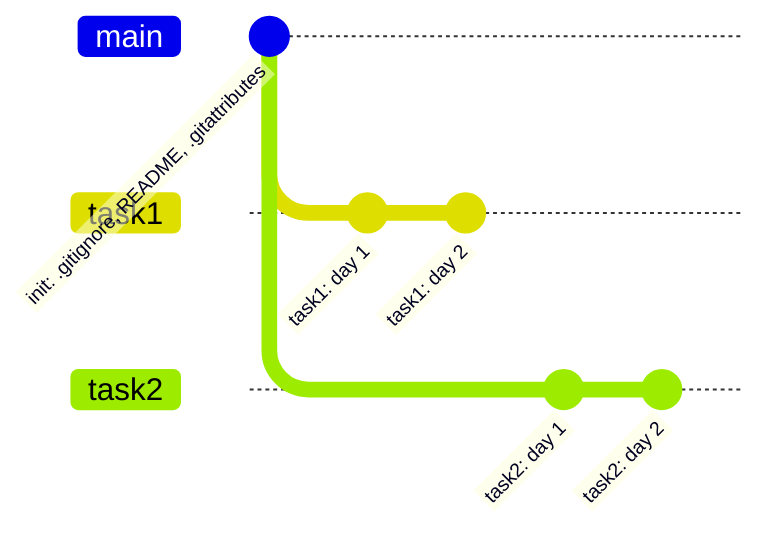

<a href="https://tquality.ru/">
  
</a>

<p align="center">
  <a href="https://tquality.ru/"></a>
  
  
</p>

---

# Добро пожаловать 👋

Это учебная организация компании **[«Точка качества»](https://tquality.ru/)** — здесь потенциальные кандидаты выполняют практические задания, получают обратную связь от куратора и технического эксперта и знакомятся с тем, как мы работаем с кодом каждый день.

Мы рады видеть вас здесь. Ниже — всё, что нужно для старта: как устроен ваш персональный репозиторий, какие правила действуют для каждого задания и что проверяет эксперт.

> [!IMPORTANT]
> Правила ниже — часть задания. Их соблюдение оценивается наравне с самим решением.

---

## Как всё устроено

1. Куратор создаёт для вас **персональный репозиторий** в этой организации и выдаёт доступ.
2. Вы согласуете с куратором **язык программирования**, на котором будете выполнять задания.
3. Каждое задание выполняется в **отдельной ветке**: `task1`, `task2`, `task3`, …
4. Готовое задание оформляется **Pull Request'ом**, ссылка на него отправляется на проверку.



---

## Структура персонального репозитория

### Ветка `main`

В `main` находятся **только три файла** — и ничего больше:

| Файл | Назначение |
| --- | --- |
| `.gitignore` | исключения для вашего языка и IDE |
| `README.md` | описание репозитория |
| `.gitattributes` | настройки определения языка репозитория |

> [!WARNING]
> Код заданий в `main` не попадает — он живёт только в ветках задач.

### Содержимое `.gitattributes`

```gitattributes
*.md linguist-documentation=false
*.md linguist-detectable
*.md linguist-language={language}
```

Вместо `{language}` — выбранный вами и **согласованный с куратором** язык (плейсхолдер заменяется целиком, вместе с фигурными скобками). Например, для Java:

```gitattributes
*.md linguist-documentation=false
*.md linguist-detectable
*.md linguist-language=Java
```

### Ветки задач

| Задание | Ветка |
| --- | --- |
| Задание 1 | `task1` |
| Задание 2 | `task2` |
| Задание 3 | `task3` |
| Задание N | `taskN` |

Ветка задачи создаётся **от актуального `main`**. Работа над заданием ведётся только в своей ветке — так каждое задание остаётся независимым и его удобно смотреть отдельно.

---

## Общие правила выполнения заданий

### 1. Коммиты — каждый день

Работа должна быть видна в истории: коммиты приходят **ежедневно** и **логическими порциями** — один коммит равен одному законченному изменению. Один большой коммит в последний день не принимается: по такой истории невозможно увидеть ход работы.

### 2. Результат — Pull Request

После завершения задания создайте PR из ветки задачи и отправьте ссылку на него:

- на **e-mail технического эксперта** — если эксперт назначен;
- в **результат задания** — если это предусмотрено условиями задания.

Мерж PR — на усмотрение куратора: сам по себе PR уже является результатом задания.

### 3. Комментарии в коде не допускаются

Код должен объяснять себя сам: говорящие имена переменных, методов и классов, короткие методы, явная структура. Если без комментария код непонятен — это сигнал переписать код, а не добавить комментарий.

### 4. Хардкод не допускается

Никаких «сырых» строк и магических чисел в коде — значения выносятся в константы, перечисления, конфигурацию или тестовые данные.

**Исключения** — сообщения ассертов и сообщения логов. При этом значения в них подставляются через форматирование логгера (если логгер это поддерживает) или через интерполяцию строк.

<table>
<tr><th>❌ Так не надо</th><th>✅ Так надо</th></tr>
<tr valign="top">
<td>

```java
driver.manage()
      .timeouts()
      .implicitlyWait(ofSeconds(10));

log.info("User " + name + " created");

assertEquals(3, cart.size());
```

</td>
<td>

```java
driver.manage()
      .timeouts()
      .implicitlyWait(DEFAULT_TIMEOUT);

log.info("User {} created", name);

assertEquals(EXPECTED_ITEMS, cart.size(),
    "Wrong item count in cart for %s".formatted(name));
```

</td>
</tr>
</table>

---

## Чек-лист перед отправкой задания

- [ ] в `main` только `.gitignore`, `README.md`, `.gitattributes`
- [ ] в `.gitattributes` указан согласованный язык вместо `{language}`
- [ ] работа выполнена в ветке `taskN`, созданной от `main`
- [ ] коммиты приходили ежедневно и логическими порциями
- [ ] в коде нет комментариев
- [ ] в коде нет магических чисел и сырых строк
- [ ] значения в логах и ассертах подставлены через форматирование или интерполяцию
- [ ] PR создан, ссылка отправлена техническому эксперту и/или приложена к заданию

---

## Полезные ссылки

- 🌐 [tquality.ru](https://tquality.ru/) — сайт компании
- 📚 [Документация GitHub про Pull Request'ы](https://docs.github.com/ru/pull-requests)
- 🧩 [Шаблоны `.gitignore` от GitHub](https://github.com/github/gitignore)

Вопросы по заданиям и доступам — вашему куратору.

<p align="center">
  <a href="https://tquality.ru/"></a>
</p>
