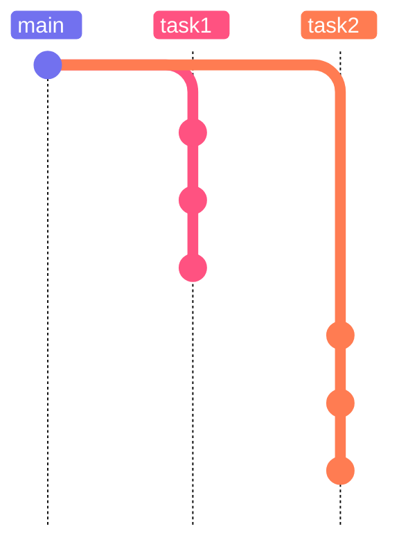

<p align="center">
  <a href="https://tquality.ru/"></a>
</p>

<p align="center">
  <a href="https://tquality.ru/education/"></a>
</p>

---

# Добро пожаловать 👋

Это учебная организация компании **[«Точка качества»](https://tquality.ru/)** — здесь потенциальные кандидаты выполняют практические задания, получают обратную связь от куратора и технического эксперта и знакомятся с тем, как мы работаем с кодом каждый день.

Мы рады видеть вас здесь. Ниже — всё, что нужно для старта: как устроен ваш персональный репозиторий, какие правила действуют для каждого задания и что проверяет эксперт.

> [!IMPORTANT]
> Правила ниже — часть задания. Их соблюдение оценивается наравне с самим решением.

---

## Как всё устроено

1. Куратор создаёт для вас **персональный репозиторий** в этой организации и выдаёт доступ.
2. Вы согласуете с куратором **язык программирования**, на котором будете выполнять задания.
3. Вы настраиваете ветку `main`: `README.md` в репозитории уже есть — к нему добавляются `.gitignore` под выбранный язык и IDE и `.gitattributes` с подставленным языком. Больше в `main` ничего не добавляется.
4. Каждое задание выполняется в **отдельной ветке**: `task1`, `task2`, `task3`, …
5. Готовое задание оформляется **Pull Request'ом**, ссылка на него отправляется на проверку.



Точки на ветках задач — ежедневные коммиты. `main` остаётся с тремя файлами: ветки задач от него отходят, но обратно не вливаются.

---

## Структура персонального репозитория

### Ветка `main`

В `main` находятся **только три файла** — и ничего больше:

| Файл | Назначение |
| --- | --- |
| `.gitignore` | исключения для вашего языка и IDE |
| `README.md` | описание репозитория |
| `.gitattributes` | настройки определения языка репозитория |

> [!WARNING]
> Код заданий в `main` не попадает — он живёт только в ветках задач.

### Содержимое `.gitattributes`

```gitattributes
*.md linguist-documentation=false
*.md linguist-detectable
*.md linguist-language={language}
```

Вместо `{language}` — выбранный вами и **согласованный с куратором** язык (плейсхолдер заменяется целиком, вместе с фигурными скобками). Например, для Java:

```gitattributes
*.md linguist-documentation=false
*.md linguist-detectable
*.md linguist-language=Java
```

### Ничего личного и никаких файлов IDE

Репозиторий содержит только то, что относится к заданию. В него **не попадает ничего, привязанного к вам и вашей машине**:

- каталоги и файлы IDE — `.idea/`, `.vscode/`, `.vs/`, `*.iml`, `*.suo`, `*.user`;
- локальные конфигурации запуска, профили, пути, логи, скриншоты, личные заметки;
- артефакты сборки и зависимости — `target/`, `build/`, `bin/`, `obj/`, `node_modules/`, `venv/`;
- файлы ОС — `.DS_Store`, `Thumbs.db`.

Всё перечисленное закрывается `.gitignore` — именно для этого он и лежит в `main`.

> [!NOTE]
> Единственное исключение — `.editorconfig`. Он допустим в двух случаях: вы **отдельно согласовали его с вашим текущим куратором** — или куратор **сам добавил его в `main`**. Во всех остальных случаях его в репозитории быть не должно.

### Ветки задач

| Задание | Ветка |
| --- | --- |
| Задание 1 | `task1` |
| Задание 2 | `task2` |
| Задание 3 | `task3` |
| Задание N | `taskN` |

Ветка задачи создаётся **от актуального `main`**. Работа над заданием ведётся только в своей ветке — так каждое задание остаётся независимым и его удобно смотреть отдельно. Ветка не удаляется и не вливается в `main` ни до, ни после проверки.

---

## Общие правила выполнения заданий

### 1. Коммиты — каждый день

Работа должна быть видна в истории: коммиты приходят **ежедневно** и **логическими порциями** — один коммит равен одному законченному изменению. Один большой коммит в последний день не принимается: по такой истории невозможно увидеть ход работы.

### 2. README задания — инструкция с нуля

В ветке задачи лежит собственный `README.md` с инструкцией для человека, у которого **ничего не установлено и не настроено**. Проверяющий разворачивает задание на чистой машине, читая только этот файл.

В нём должно быть:

- **что это за задание** и что делает решение — коротко;
- **требования** с версиями: язык, менеджер пакетов, сборщик, а также браузер, драйверы, БД, docker — всё, что нужно;
- **шаги установки** этих требований — по порядку, командами, которые можно скопировать и выполнить;
- **изолированное окружение**, если язык это предполагает: `python -m venv`, `nvm use`, локальный toolchain/SDK. Зависимости ставятся в него, а не в систему;
- **запуск**: как выполнить решение и тесты и что должно получиться в результате.

> [!WARNING]
> Инструкция не должна опираться на глобальное состояние вашей машины: уже установленные пакеты, «и так настроенные» переменные окружения, пути вида `C:\Users\...`, руками положенные драйверы. Всё нужное ставится по шагам из README и живёт внутри проекта.

### 3. Результат — Pull Request

После завершения задания создайте PR из ветки задачи в `main` и отправьте ссылку на него:

- на **e-mail технического эксперта** — если эксперт назначен;
- в **результат задания** — если это предусмотрено условиями задания.

> [!CAUTION]
> **PR никогда не мержится в `main`** — ни вами, ни проверяющим. PR создаётся исключительно для того, чтобы:
> - показать проверяющему diff по заданию;
> - дать возможность оставить комментарии к любой строке кода;
> - зафиксировать, что задание завершено.
>
> PR и ветка задачи остаются открытыми, `main` не меняется.

### 4. Доработка после ревью — в том же PR

Если по итогам ревью пришли замечания, **новый PR не создаётся**. Порядок такой:

1. Внесите правки и запушьте их в **ту же ветку задачи** — PR обновится автоматически.
2. Отправьте проверяющему **ту же самую ссылку** на PR: на e-mail технического эксперта и/или в результат задания — так же, как при первой отправке.

Правило про ежедневные логические коммиты действует и на доработку: правки приходят отдельными коммитами, а не переписыванием истории.

### 5. Комментарии в коде не допускаются

Код должен объяснять себя сам: говорящие имена переменных, методов и классов, короткие методы, явная структура. Если без комментария код непонятен — это сигнал переписать код, а не добавить комментарий.

### 6. Хардкод не допускается

Никаких «сырых» строк и магических чисел в коде — значения выносятся в константы, перечисления, конфигурацию или тестовые данные.

**Исключения** — сообщения ассертов и сообщения логов. При этом значения в них подставляются через форматирование логгера (если логгер это поддерживает) или через интерполяцию строк.

**❌ Так не надо**

```java
driver.manage()
      .timeouts()
      .implicitlyWait(ofSeconds(10));

log.info("User " + name + " created");

assertEquals(3, cart.size());
```

**✅ Так надо**

```java
driver.manage()
      .timeouts()
      .implicitlyWait(DEFAULT_TIMEOUT);

log.info("User {} created", name);

assertEquals(EXPECTED_ITEMS, cart.size(),
    "Wrong count for %s".formatted(name));
```

---

## Чек-лист перед отправкой задания

- [ ] в `main` только `.gitignore`, `README.md`, `.gitattributes`
- [ ] в `.gitattributes` указан согласованный язык вместо `{language}`
- [ ] работа выполнена в ветке `taskN`, созданной от `main`
- [ ] коммиты приходили ежедневно и логическими порциями
- [ ] в ветке задачи есть `README.md`: требования с версиями, шаги установки, изолированное окружение, запуск
- [ ] инструкция проверена на чистом окружении и не зависит от глобального состояния машины
- [ ] в репозитории нет файлов IDE и локального окружения (`.idea/`, `.vscode/`, `*.iml`, артефакты сборки)
- [ ] `.editorconfig` отсутствует, согласован с куратором или добавлен самим куратором
- [ ] в коде нет комментариев
- [ ] в коде нет магических чисел и сырых строк
- [ ] значения в логах и ассертах подставлены через форматирование или интерполяцию
- [ ] PR создан, ссылка отправлена техническому эксперту и/или приложена к заданию
- [ ] PR открыт и **не смержен** в `main`
- [ ] после доработки по ревью — правки запушены в ту же ветку, повторно отправлена та же ссылка на PR

---

## Полезные ссылки

- 🌐 [tquality.ru](https://tquality.ru/) — сайт компании
- 🎓 [tquality.ru/education](https://tquality.ru/education/) — обучение и курсы тестировщиков
- ✉️ [job@tquality.ru](mailto:job@tquality.ru) — почта по вопросам участия в программе
- 📚 [Документация GitHub про Pull Request'ы](https://docs.github.com/ru/pull-requests)
- 🧩 [Шаблоны `.gitignore` от GitHub](https://github.com/github/gitignore)

Вопросы по заданиям и доступам — вашему куратору.

<div align="center">

[](https://tquality.ru/)

</div>
